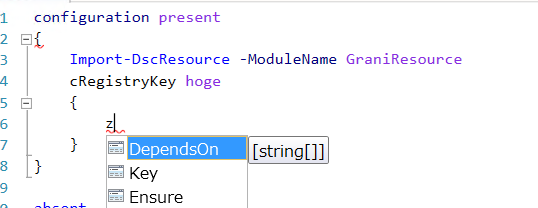

Grani_RegistryKey
============

DSC Resource to configure Registry SubKey.

Resource Information
----

Name | FriendlyName | ModuleName 
-----|-----|-----
Grani_RegistryKey | cRegistryKey | GraniResource

Test Status
----

See GraniResource.Test for the detail.

Method | Result
----|----
Pester| pass
Configuration| pass
Get-DSCConfiguration| pass
Test-DSCConfiguration| pass

Intellisense
----



Sample
----

- Add RegistryKey

this will add subkey name ```fuga/nyao``` and it's parent.

```powershell
configuration present
{
    Import-DscResource -ModuleName GraniResource
    cRegistryKey hoge
    {
        Key = "HKEY_LOCAL_MACHINE\SOFTWARE\hoge/piyo\fuga/nyao"
        Ensure = "Present"
    }    
}
```

- Remove RegistryKey

this will remove fuga/nyao subkey only. parent subkey tree will remain.

```powershell
configuration absent
{
    Import-DscResource -ModuleName GraniResource
    cRegistryKey hoge
    {
        Key = "HKEY_LOCAL_MACHINE\SOFTWARE\hoge/piyo\fuga/nyao"
        Ensure = "Absent"
    }    
}
```

Tips
----

**When do I need to use it?**

- Scene 1. Manage Registry SubKey only.

As MSFT_Registry never handle Registry SubKey, but it only handle Registry key/values. This resource will allow you to manage Registry SubKey where it doesn't exist for Regisry Value.

- Scene 2. Prevent MSFT_Registry Issue

As MSFT_Registy have issue with creating registry subkey which contains slash ```/```, like "HKEY_LOCAL_MACHINE\hoge/fuga\nyao". MSFT_Registry Resource will confuse ```/``` as path separater. It means MSFT_Registry resource understand that as "HKEY_LOCAL_MACHINE\hoge\fuga\nyao", oh.....

You will find it fixded issue with cRegistryKey resource.