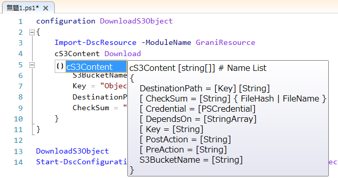

Grani_S3Content
============

DSC Resource to download content from S3.

Resource Information
----

Name | FriendlyName | ModuleName 
-----|-----|-----
Grani_S3Content | cS3Content | GraniResource

Test Status
----

See GraniResource.Test for the detail.

Method | Result
----|----
Pester| pass
Configuration| pass
Get-DSCConfiguration| pass
Test-DSCConfiguration| pass

Intellisense
----



Sample
----

- Download S3Object from Desired S3Bucket.

You may use it for code or any string items.

```powershell
configuration DownloadS3Object
{
    Import-DscResource -ModuleName GraniResource
    cS3Content Download
    {
        S3BucketName = "YourBucketName"
        Key = "ObjectName"
        DestinationPath = "c:\Path\To\Save\Content"
    }
}
```

Dependancy
----

- [AWSpowerShell](http://aws.amazon.com/powershell/) 

You will find it already install by default at Windows EC2 Instance.

- [IAM Role](http://docs.aws.amazon.com/AWSEC2/latest/UserGuide/iam-roles-for-amazon-ec2.html)

This is the best standard for AWS. Don't manage credential by your own, but pass it to IAM.

When IAM Role is attached to your instance, S3 Bucket policy can control Where / What / How to access it's object.


