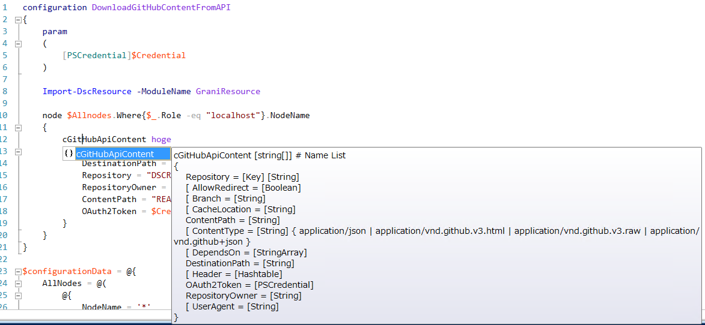

Grani_GitHubApiContent
============

DSC Resource to download content from Github API.

Resource Information
----

Name | FriendlyName | ModuleName 
-----|-----|-----
Grani_GitHubApiContent | cGitHubApiContent | GraniResource

Test Status
----

See **Test** Project for the detail.

Method | Result
----|----
Pester| pass
Configuration| pass
Get-DSCConfiguration| pass
Test-DSCConfiguration| pass

Intellisense
----



Sample
----

- Download string content from GitHub API. 

You may use it for code or any string items.

```powershell
configuration DownloadGitHubContentFromAPI
{
    param
    (
        [PSCredential]$Credential
    )

    Import-DscResource -ModuleName GraniResource

    node $Allnodes.Where{$_.Role -eq "localhost"}.NodeName
    {
        cGitHubApiContent cGitHubContent
        {
            DestinationPath = "C:\Tools\README.md"
            Repository = "DSCResources"
            RepositoryOwner = "guitarrapc"
            ContentPath = "README.md"
            OAuth2Token = $Credential
        }
    }
}

$configurationData = @{
    AllNodes = @(
        @{
            NodeName = '*'
            PSDSCAllowPlainTextPassword = $true
        }
        @{
            NodeName = "localhost"
            Role     = "localhost"
        }
    )
}
```

- Download raw content from GitHub API. 

You may use it for .zip or image items.

```powershell
configuration DownloadGitHubRawContentFromAPI
{
    param
    (
        [PSCredential]$Credential
    )

    Import-DscResource -ModuleName GraniResource

    node $Allnodes.Where{$_.Role -eq "localhost"}.NodeName
    {
        cGitHubApiContent cGitHubContent
        {
            DestinationPath = "C:\Tools\xDscResourceDesigner.zip"
            Repository = "DSCResources"
            RepositoryOwner = "guitarrapc"
            ContentPath = "MicrosoftScriptCenter/xDSCResourceDesigner.zip"
            OAuth2Token = $Credential
            ContentType = "application/vnd.github.v3.raw"
        }
    }
}

$configurationData = @{
    AllNodes = @(
        @{
            NodeName = '*'
            PSDSCAllowPlainTextPassword = $true
        }
        @{
            NodeName = "localhost"
            Role     = "localhost"
        }
    )
}
```

Tips
----

**Authentication**

GitHub API requires OAuth2Token == AccessToken to access Repository. Thus please pass OAuth2Token inside ```PSCredential``` password section. Username section will ignore.

Why resource using ```PSCredential```? Because DSC have mechanism of Encrypt your password inside mof by SSL Certificate.

See detail about securing mof at  [Windows PowerShell Blog](http://blogs.msdn.com/b/powershell/archive/2014/01/31/want-to-secure-credentials-in-windows-powershell-desired-state-configuration.aspx)

**Treat with CRLF problem**

As you are familiar with, Windows string files are used to be CRLF besides Linux/Unix using LF.

Think about GitHub, there are ```autocrlf``` and you will find difficulty with downloaded content was broken with BOM or CRLF.

I recommend use ContentType ```application/vnd.github.v3.raw``` for these not controllable string data file or RAW files.

**Trace Remote file change**

Grani_Download will not trace remote file change in default.

If you want to change on remote file, there are 2 way would be thinkable.

1. Always download Remote content and override on local.
2. Download on temp location, hash check and override if change detected.

Both way would try to connect remote content. It means if there are any Rate Limit on API then API will consume every time access. Grani_Download avoid this API consume by not tracing remote file change.

You can do way 1 by passing LCM special location which will erace every time LCM try to run (SET).

```powershell
configuration DownloadGitHubRawContentFromAPI
{
    param
    (
        [PSCredential]$Credential
    )

    Import-DscResource -ModuleName GraniResource

    node $Allnodes.Where{$_.Role -eq "localhost"}.NodeName
    {
        cGitHubApiContent cGitHubContent
        {
            DestinationPath = "C:\Tools\xDscResourceDesigner.zip"
            Repository = "DSCResources"
            RepositoryOwner = "guitarrapc"
            ContentPath = "MicrosoftScriptCenter/xDSCResourceDesigner.zip"
            OAuth2Token = $Credential
            ContentType = "application/vnd.github.v3.raw"
            CacheLocation = "$env:ProgramData\Microsoft\Windows\PowerShell\Configuration\BuiltinProvCache\Grani_Download"
        }
    }
}

$configurationData = @{
    AllNodes = @(
        @{
            NodeName = '*'
            PSDSCAllowPlainTextPassword = $true
        }
        @{
            NodeName = "localhost"
            Role     = "localhost"
        }
    )
}
```
